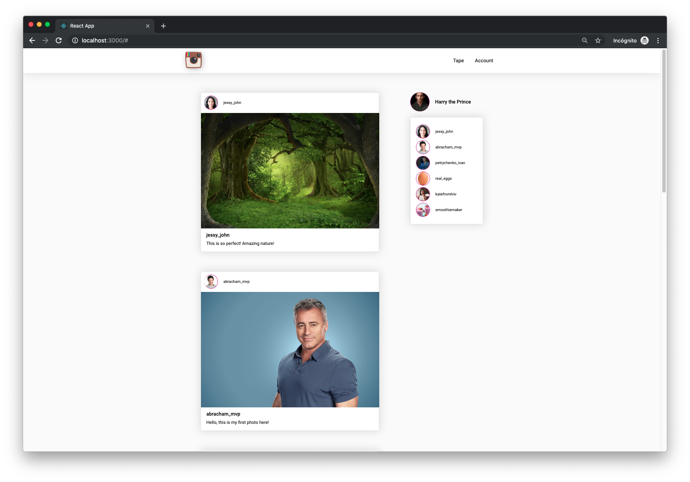

# insta-react

It's a simple React web single-page application SPA working example of the light version ot the Instagram.
  
To emulate a REST API is used a JSON Server with mock data from the JSON file. 

You will need:
* [Node.js](https://nodejs.org/en/)
* [Create React App](https://facebook.github.io/create-react-app/docs/getting-started)
* [JSON Server](https://github.com/typicode/json-server) on --port=3001
* [React-Router](https://reacttraining.com/react-router/web/guides/quick-start) (or local json files with example data)

#### Demo:
The project was published on Netlify demo page https://confident-bassi-4308d7.netlify.com/

#### Screenshots:

